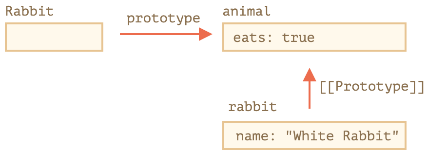
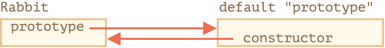
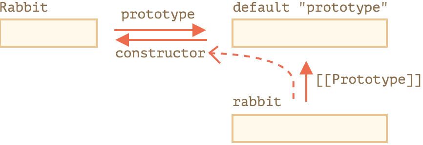

# 第一部分 JavaScript编程语言

## 7、对象属性配置

### 7.1 属性标志和属性描述符

#### 属性标志

* value - 值的名字
* writable - 如果为true，则值可以被修改，否则是只读的。
* enumerable - 如果为true，则会在列表中列出，否则不会被列出。
* configuable - 如果是true，则此特性可以被删除，这些属性也可以被修改，否则不可以。

获取属性的标志用 `Object.getOwnPropertyDescriptor` 方法：
```js
let descriptor = Object.getOwnPropertyDescriptor(obj, propertyName);
```
#### Object.defineProperty
修改标志的值用 `Object.defineProperty`  方法：
```js
Object.defineProperty(obj, propertyName, descriptor)
```
还可以使用 `Object.defineProperties`  一次定义多个属性
`configurable:false`  是一条单行道，变不回去了。它的用途是防止更改和删除属性标志，但是允许更改对象的值。

#### Object.getOwnPropertyDescriptors
一次性获取对象所有的属性的描述，用 `Object.getOwnPropertyDescriptors`
`for..in`  循环并不能复制标志。并且，`for...in` 会忽略symbol类型的属性名（也会忽略function），但是，`Object.getOwnPropertyDescriptors` 会返回**所有**属性描述符。
```js
let clone = Object.defineProperties({}, Object.getOwnPropertyDescriptors(obj));
```

### 7.2 属性的 getter 和 setter

有两种类型的对象属性。**数据属性**和**访问器属性**。
访问器属性由 getter 和 setter 方法表示。
```js
let obj = { 
    get propName() { // 当读取 obj.propName 时，getter 起作用 }, 
    set propName(value) { // 当执行 obj.propName = value 操作时，setter 起作用 }
};
```
#### 访问器的描述
访问器的描述与数据属性不同。可能有
* get - 一个没有参数的函数，在读取属性时工作
* set - 带有一个参数的函数，当属性被设置时调用
* enumerable 
* configurable

#### 更聪明的 getter/setter

Getter/setter 可以用作“真实”属性值的包装器，以便对它们进行更多的控制。

例如，如果我们想禁止太短的 user 的 name，我们可以创建一个 setter name，并将值存储在一个单独的属性 _name 中：
```js
let user = {
  get name() {
    return this._name;
  },
  set name(value) {
    if (value.length < 4) {
      alert("Name is too short, need at least 4 characters");
      return;
    }
    this._name = value;
  }
};
user.name = "Pete";
alert(user.name); // Pete
user.name = ""; // Name 太短了……
```

所以，name 被存储在 _name 属性中，并通过 getter 和 setter 进行访问。

从技术上讲，外部代码可以使用 user._name 直接访问 name。但是，这儿有一个众所周知的约定，即以下划线 "_" 开头的属性是内部属性，不应该从对象外部进行访问。

## 8、原型、继承

### 8.1 原型继承

#### [[Prototype]]

在 JavaScript 中，对象有一个特殊的隐藏属性 `[[Prototype]]`（如规范中所命名的），它要么为 ` null` ，要么就是对另一个对象的引用。该对象被称为“原型”

当我们从 `object` 中读取一个缺失的属性时，JavaScript 会自动从原型中获取该属性。在编程中，这种行为被称为“原型继承”。很快，我们将通过很多示例来学习此类继承，以及基于此类继承的更炫酷的语言功能。

属性 `[[Prototype]]`  是内部的而且是隐藏的，但是这儿有很多设置它的方式。

其中之一就是使用特殊的名字 `__proto__`

```js
let animal = {
  eats: true
};
let rabbit = {
  jumps: true
};
rabbit.__proto__ = animal; // 设置 rabbit.[[Prototype]] = animal
```
> `__proto__`  是 ` [[Prototype]]`  的因历史原因而留下来的 getter/setter
> 初学者常犯一个普遍的错误，就是不知道` __proto_`_ 和 `[[Prototype]]` 的区别。
> 请注意，`__proto__`  与内部的 `[[Prototype]]`  **不一样**。`__proto_`_  是 `[[Prototype]]`  的 getter/setter。稍后，我们将看到在什么情况下理解它们很重要，在建立对 JavaScript 语言的理解时，让我们牢记这一点。
> `__proto__` 属性有点过时了。它的存在是出于历史的原因，现代编程语言建议我们应该使用函数 `Object.getPrototypeOf/Object.setPrototypeOf` 来取代 `__proto__` 去 get/set 原型。

#### 写入操作时不使用原型

原型仅用于读取属性。
对于写入/删除操作可以直接在对象上进行。

#### this

`this` 根本不受原型的影响。

**无论在哪里找到方法：在一个对象还是在原型中。在一个方法调用中，this 始终是点符号 . 前面的对象。**

#### for…in 循环

`for..in`  循环也会迭代继承的属性。

如果迭代需要排除继承的属性，使用 `obj.hasOwnProperty(key)`  来判断是否是自己的属性。

> **几乎所有其他键/值获取方法都忽略继承的属性。**
> 几乎所有其他键/值获取方法，例如 `Object.keys` 和 `Object.values`  等，都会忽略继承的属性。
> 它们只会对对象自身进行操作。**不考虑** 继承自原型的属性。


#### 总结
* 在 JavaScript 中，所有的对象都有一个隐藏的 `[[Prototype]]` 属性，它要么是另一个对象，要么就是 `null`。
* 我们可以使用 `obj.__proto__` 访问它。
* 通过 `[[Prototype]]` 引用的对象被称为“原型”。
* 如果我们想要读取 `obj`  的一个属性或者调用一个方法，并且它不存在，那么 JavaScript 就会尝试在原型中查找它。
* 写/删除操作直接在对象上进行，它们不使用原型（假设它是数据属性，不是 setter）。
* 如果我们调用 `obj.method()`，而且 `method` 是从原型中获取的，this 仍然会引用 obj。因此，方法始终与当前对象一起使用，即使方法是继承的。
* `for..in`  循环在其自身和继承的属性上进行迭代。所有其他的键/值获取方法仅对对象本身起作用。

### 8.2、F.prototype
可以使用诸如 `new F()` 这样的构造函数来创建一个新对象。

如果 `F.prototype` 是一个对象，那么 `new` 操作符会使用它为新对象设置 `[[Prototype]]`。

```js
let animal = {
  eats: true
};

function Rabbit(name) {
  this.name = name;
}

Rabbit.prototype = animal;

let rabbit = new Rabbit("White Rabbit"); //  rabbit.__proto__ == animal

alert( rabbit.eats ); // true
```
设置 `Rabbit.prototype = animal` 的字面意思是：“当创建了一个 `new Rabbit` 时，把它的 `[[Prototype]]` 赋值为 animal”。



在上图中，`"prototype"` 是一个水平箭头，表示一个常规属性，`[[Prototype]]` 是垂直的，表示 `rabbit` 继承自 `animal`。

> **F.prototype 仅用在 new F 时**
> `F.prototype` 属性仅在 `new F` 被调用时使用，它为新对象的 `[[Prototype]]` 赋值。
> 如果在创建之后，`F.prototype` 属性有了变化（`F.prototype = <another object>`），那么通过 `new F` 创建的新对象也将随之拥有新的对象作为 `[[Prototype]]` ，但已经存在的对象将保持旧有的值。

#### 默认的 F.prototype，构造器属性

每个函数都有 "prototype" 属性，即使我们没有提供它。

默认的 "prototype" 是一个只有属性 constructor 的对象，属性 constructor 指向函数自身。

```js
function Rabbit() {}

/* default prototype
Rabbit.prototype = { constructor: Rabbit };
*/
```



```js
function Rabbit() {}
// by default:
// Rabbit.prototype = { constructor: Rabbit }

alert( Rabbit.prototype.constructor == Rabbit ); // true
```

如果我们什么都不做，`constructor` 属性可以通过 `[[Prototype]]` 给所有 rabbits 使用：

```js
function Rabbit() {}
// by default:
// Rabbit.prototype = { constructor: Rabbit }

let rabbit = new Rabbit(); // inherits from {constructor: Rabbit}

alert(rabbit.constructor == Rabbit); // true (from prototype)
```


我们可以使用 `constructor` 属性来创建一个新对象，该对象使用与现有对象相同的构造器。

```js
function Rabbit(name) {
  this.name = name;
  console.log(name);
}

let rabbit = new Rabbit("White Rabbit");

let rabbit2 = new rabbit.constructor("Black Rabbit");
```
